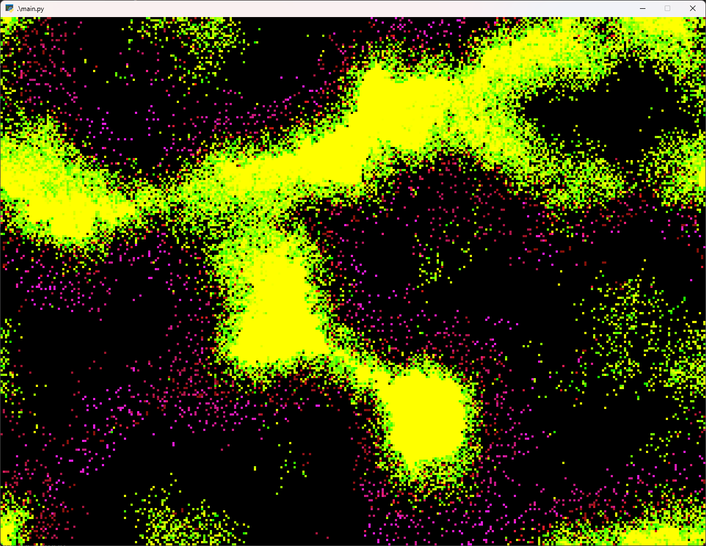

# Wa-Tor for Python

This is a Python implementation of A.K. Dewdney's mathematical game Wa-Tor.

It simulates ocean life, where colonies of sharks feed on colonies of fish.

You can play with some of the starting parameters in `Window.init`, but the tunings I have right now result in some very pleasant-looking steady-state patterns over time.

## Requirements

* Pyglet 2

Optionally, Cython, as the `compile.py` script will compile the `draw.py` module for some speed improvements. I haven't optimized it much yet, though.

## License

MIT